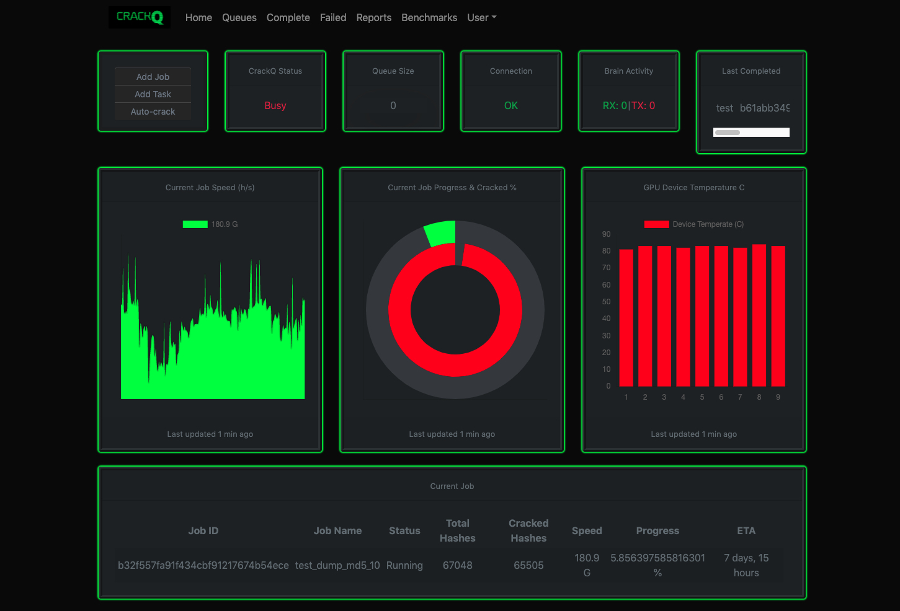

CrackQ
============

Author: Daniel Turner @ Trustwave
------------

**INTRODUCTION**
---------------

Python 3 REST API & JS GUI for managing hashcat crack jobs in a queuing system.



**Install**
----------------

**Requirements**

This tool has the following requirements:

* Drivers
	* OpenCL drivers - these can be installed from a repository or downloaded from the relevant vendor. Tested using Intel runtime.
	* Nvida drivers
	* AMD drivers

* Docker

* Nvidia-runtime

* Docker-compose

It is recommended to have a hefty server build with ample RAM/CPU power. However, the application has been tested on a VM with 8 cores and 4GB RAM so there should not be any issues with resources given that the server will need a good amount of resources for cracking anyway.

See INSTALL.md for full installation guide.

---------
**Admin Guide**


To start the application use the following

```docker-compose -f docker-compose.nvidia.yml up --build```

To wipe all images/containers and start fresh build use:

```docker system prune -a```

Some admin scripts are included under /utils, these are very rough small scripts which I am adding to as the need arises.

---------
**User Guide**

To use the queue a JavaScript GUI is available by browsing to the web server root: https://crackq.xxx.com

Where crackq.xxx.com is the name used during the configuration/install process (set within crackq_nginx.conf), as outlined in *install.txt*.

Alternatively, a Python client is provided at: https://github.com/f0cker/crackq_client 

-----
**Further Notes**

The following files are used during operation for logging and state management:

* */var/crackq/logs/crackq.log*

Detailed application logs can be found in the above log file for debugging any issues.


-----
**Acknowledgements**

Thanks to everyone that helped testing CrackQ:

Michal Talecki

Cauan Guimaraes

John Anderson

Jose Plascencia

@SpiderLabs

...and of course:

Hashcat!

Rich5 - PyHashcat
